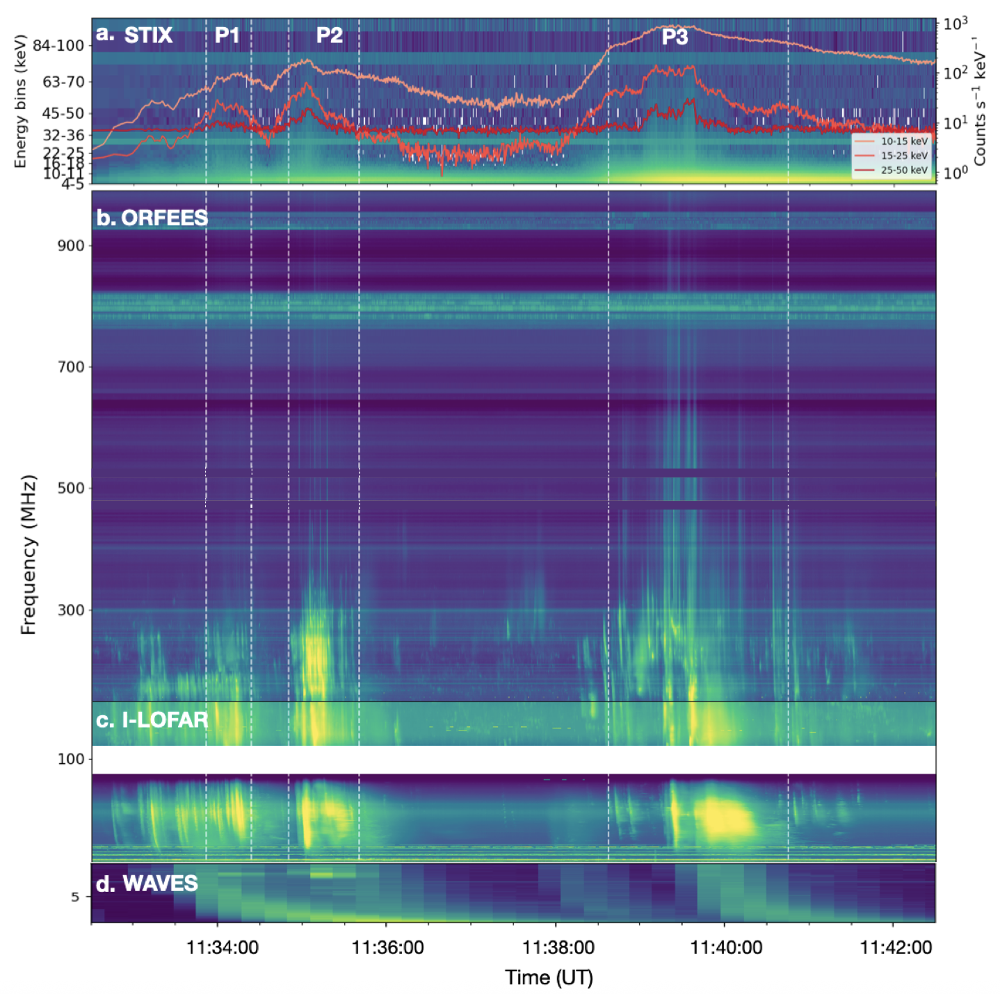
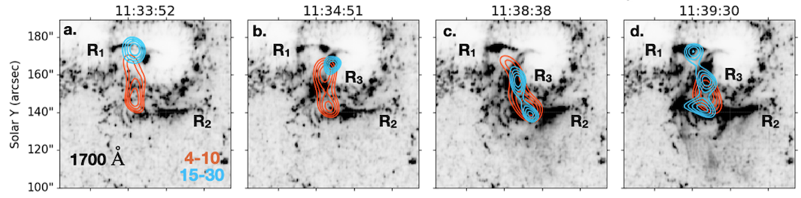
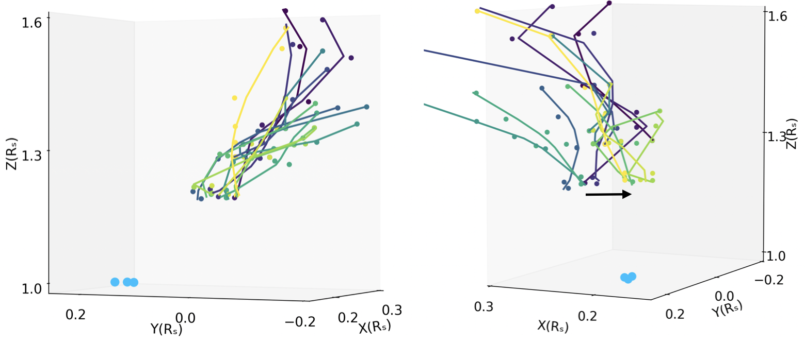

## Overview

During solar flares, magnetic reconnection releases energy and accelerates
electrons to non-thermal energies. Electrons propagating toward the lower solar
atmosphere produce hard X-ray (HXR) emission through interactions with the
dense ambient plasma, while electron beams propagating through the corona can
generate radio emission. Together, HXR and radio observations therefore provide
complementary diagnostics of flare-accelerated electrons.

Solar flares often show fine temporal structures in HXR emission together with
multiple bursts at radio wavelengths. These signatures may reflect a fragmented
energy-release process, in which electrons are accelerated in a series of
discrete episodes rather than through a single continuous acceleration event.

I am interested in understanding this bursty nature of electron acceleration
and how the accelerated electron beams propagate through the solar corona. By
combining X-ray observations from Solar Orbiter/STIX with ground-based radio
observations, I investigate the temporal signatures of electron acceleration
and trace the trajectories of flare-accelerated electron beams in the low
solar corona.

  

## Bursty Electron Acceleration

In **[Bhunia et al. (2025)](https://doi.org/10.1051/0004-6361/202451426)**, I investigated a flare that exhibited several
distinct non-thermal HXR peaks. Imaging these individual peaks with STIX
revealed non-thermal HXR sources at different locations within the flaring
region, providing spatial evidence for multiple injections of accelerated
electrons.

Together with the multiple radio bursts observed during the flare, these
temporal and spatial signatures point to a bursty and fragmented electron
acceleration process.

  

## Tracing Electron-Beam Trajectories in 3D

To track the flare-accelerated electrons into the upper corona, I reconstructed
the 3D trajectories of individual radio bursts using imaging observations from
the Nançay Radioheliograph (NRH) together with a coronal density model. The
electron beams followed distinct trajectories, indicating propagation along
different open and closed magnetic field lines.

  

The HXR and radio source locations also showed correlated changes during the
flare, suggesting a common acceleration source for the X-ray- and radio-emitting
electrons. Together, the different HXR source locations, radio-burst trajectories,
and their evolution provide evidence that electron acceleration in this flare
was fragmented both **temporally and spatially**.
