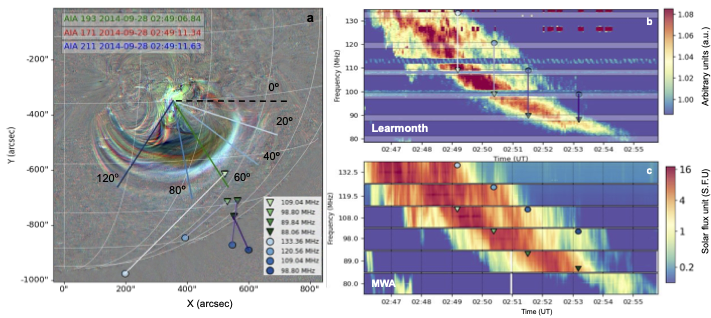
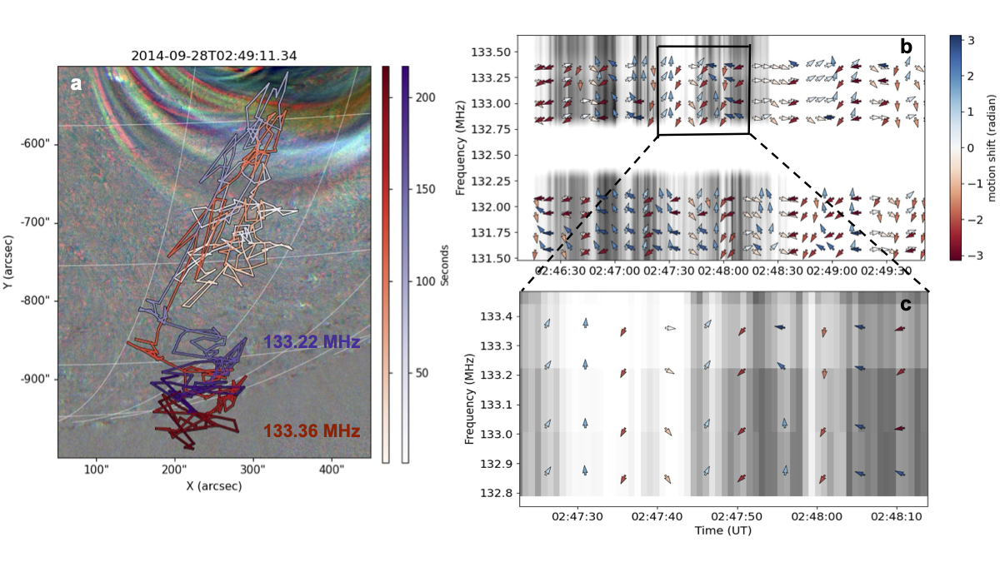

## Overview

Type II solar radio bursts are signatures of shock waves driven by solar eruptive events such as coronal mass ejections (CMEs), flares, and jets. These bursts often exhibit a variety of structures with distinct temporal and spectral characteristics. Understanding these fine structures is important for investigating the physical properties of coronal shocks, shock-accelerated electrons, and the plasma environment through which the radio emission propagates. I am particularly interested in understanding these structures from two perspectives. The first is **band splitting**, where the fundamental and/or harmonic emission can split into two lanes. The second is the fine-scale temporal and spatial behaviour of the radio sources, and what these variations can reveal about **density turbulence in the solar corona**.

I investigate these aspects using high-resolution radio imaging spectroscopy,
which makes it possible to connect structures observed in the dynamic spectrum
with the spatial behaviour of their corresponding radio sources.

## Understanding Type II Band Splitting

Despite being frequently observed in Type II bursts, the physical origin of
these split bands remains unclear. Two main interpretations have been proposed.
The commonly invoked scenario suggests that the two bands originate from the
upstream and downstream regions of the shock. An alternative interpretation
is that the emission originates from spatially separated regions of the shock
front.

In **[Bhunia et al. (2023)](https://doi.org/10.1051/0004-6361/202244456)**,
I used high-resolution imaging spectroscopy from the Murchison Widefield Array
(MWA) and found that the two split-band sources were spatially separated,
supporting the latter interpretation for this event. This result has important implications for shock diagnostics, as the upstream–downstream interpretation is commonly used to estimate shock properties such as the Mach number and coronal magnetic-field strength, highlighting the importance of full imaging spectroscopy when interpreting Type II band splitting.

  

## Probing Coronal Density Turbulence

Type II radio sources can show complex, apparently random motion on short
timescales. In the Type II burst studied here, the source motion was
systematically correlated across nearby frequencies.

These correlated position shifts provide a way to probe density fluctuations
in the corona through which the radio waves propagate. By examining how the
correlation of the source motion changes with frequency separation, I developed
a technique to estimate the effective length scale of turbulent density
perturbations in the solar corona, obtaining a scale of approximately **1–2 Mm**
for this event.

  

